# Amazon web services 

## Cómputo en la nube de amazon 

AWS consiste en la creación de maquinas virtuales. Con estas podemos hacer:

- crear sitios web -> lo más simple sería instalar un LAMP (Linux Apache MySQL PhP) o irnos a algo más complejo como infrastructura (para gestionar gran volumen de users)
  
- Respaldos y recuperación -> backups de VM completas(virtual machines) 
  
- Archivos permanentes -> podemos almacenar archivos estáticos como fotos, documentos,...
  
- DevOps -> En este área, no solamente se cuenta con automatización en el release de los nuevos proyectos, sino también con una alta disponibilidad o respaldos automatizados en diversos lugares del mundo, que pueden ser diarios y pueden ser escalables, como por ejemplo, desde 5 usuarios hasta 3000 en dos minutos.
  
- Cálculos analíticos masivos -> podemos medir muchas cosas desde cuanta RAM usa nuestra app, nucleos que necesita, etc...
  
- Cómputo serverless (Lambda)-> es un servicio que permite despreocuparnos de los requerimientos del servidor simplemente AWS calcula cuanta potencia (RAM, procesadores,...) necesita tu app y se va adaptando según lo necesites, por ejemplo por un momento puntual tinees muchas entradas de users entonces AWS escala para poder gestionar todos esos users y solo pagas por los request realizados a tu app. Básicamente AWS hace una partición de tu software y lo expone a través de microservicios (qque pueden interatuar entre ellos, cn bbdd, etc..) y escala esos microservicios según sus necesidades.
  
- Cómputo de alto rendimiento -> si necesitas hacer de manera puntual un cálculo que requiere de gran potencia solo pagas por ese momento puntual. 

- Internet de las cosas -> puedes tener acceso a hardware y cómo interactuar cn esos dispositivos, el gateway para poder mandarles datos.

- Aplicaciones empresariales -> AWS tiene aplicaciones empresariales tradicionales, como por ejemplo, correos empresariales, que, al igual que otros servicios, escala de manera automática y profesional. 

- Distribución de media -> Con este servicio, AWS te brinda mecanismos de transcoding. Por ejemplo, si se desea realizar un streaming, este servicio brinda todo lo necesario para poder llegar a la cantidad de personas que se quiera.

- Servicios móviles -> te provee de todos los servicios móviles para que puedas interactuar cn tu bbdd 

- Cómputo científico ->  AWS tiene máquinas especializadas (más memoria RAM, más CPU, más cores trabajando al mismo tiempo, etc.) para el cómputo enfocado a la parte científica, como pueden ser, simulaciones físicas, simulaciones financieras, etc.

- E-Commerce ->  Este servicio incluye todos los componentes necesarios para hacer una página de ventas virtual. Entre esos componentes, están la parte de seguridad, comunicación con la base de datos de manera segura, tantos servidores como sean necesarios; del lado de la base de datos incluye respaldos, optimizaciones para expandir o disminuir la base de datos de acuerdo al uso, etc.

- Ambientes híbridos -> Este área de AWS brinda la posibilidad de poder trabajar con información en la nube, y al mismo tiempo con datos de manera local hosteados en un servidor propio. Esto se hace si tienes datos privados sensibles que no quieres hostear en la nube.

- Blockchain -> Este sistema permite realizar acciones, como por ejemplo, minar, hacer análisis de la información para verificar que no esté siendo modificada o alterada en el camino, entre otras.

## Algunas de las ventajas de utilizar AWS:

Usa lo que necesites, apaga lo que no: AWS brinda la posibilidad de encender los servicios cuando se vaya a hacer uso de ellos y de apagarlos cuando no se vayan a utilizar. De esta manera, AWS sólo cobra por el tiempo en el que utilicemos dichos servicios.

Crece tanto como sueñes: AWS permite una escalabilidad a alta velocidad. Esto facilita la posibilidad de crecer o decrecer tanto como se necesite.

Velocidad cuando la necesitas: AWS no sólo brinda la posibilidad de administrar y de escalar a nivel de hardware, también se puede hacer con la velocidad de cómputo de los servidores. Es algo que no se encuentra en otras alternativas a AWS.

Cobertura mundial: Amazon tiene diversos datacenters en distintos lugares del mundo, y no sólo en distintos lugares del mundo, sino que, por ejemplo, Amazon tiene un datacenter en Brasil, pero no es únicamente un datacenter; son tres o cuatro edificios llamados “zonas”, es decir, cuatro zonas en ese datacenter, cada una con electricidad autónoma, con datos autónomos, etc. de tal manera que se puede tener la confianza de que aunque fallase algún datacenter, hay otros dos o tres que van a responder por el que esté fallando. En ciertos lugares hay limitaciones, como por ejemplo, en los datacenters de China no se pueden almacenar cierto tipos de datos o de información. También es bueno tener en cuenta la ubicación de los datacenters; por ejemplo, en Latinoamérica, el más cercano es el de Brasil, por lo que ese datacenter va a ser mejor en términos de latencia y en temas por el estilo.

## Ejemplo de arquitectura con elastik Beanstalk 

crearemos una app con elastik Beanstalk y cómo los distintos servicios interactuan. 

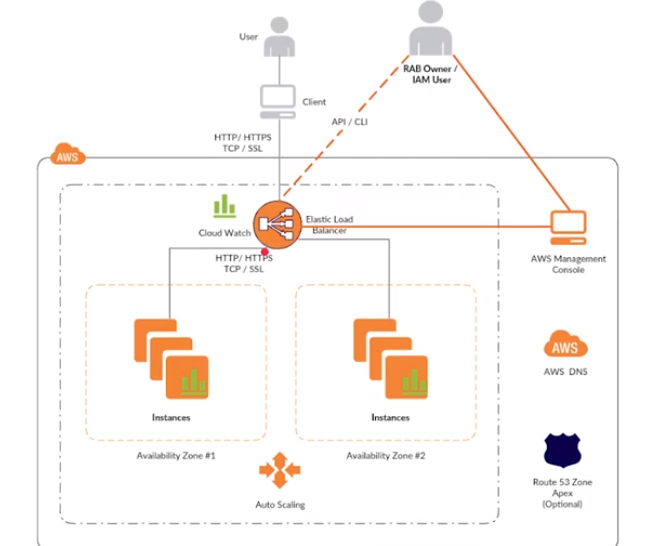

1. el user se conecta mediante HTTP/SSL (secure socket layer) a un endpoint que conecta con `elastic load balancer`
2. `elastic load balancer` permite gestionar las peticiones (HTTP/S / SSL ) que llegan, en el caso de HTTPS te permite poner el certificado que tu decidas (sin comprar un certificado, lo proporciona AWS), actualmente reconocido por la mayoria de browsers
3. elastic load balancer lleva la petición a unas instancias (son servidores de aplicaciones, continen instancias de tu app ) este sistema tiene autoscaling pq esta en `elastic beanstalk` entonces puedes decidir escalar según lo que necesites en función a diferentes métricas, x ej si tienes usuarios que tienen una latencia mayor a 20 s pues quizá te interesa levantar otro servirdor para q el user no tarde tanto en abrir la web app.
4. al mismo tiempo del load balancer tb tiene una conexión con `cloud watch` que te permite ver número de request, como está funcionando la app, si necesitas expandir el número de servidores o instancias. El número de instancias que estás gestionando tb se reflejan en cloud watch.

5. como dueño de la infraestructura puedes acceder a elastic load balancer mediante un API o con la consola de amazon (AWS management console) podemos modificar ciertas cosas como añadir nuevas instancias.
   
6. AWS ofrece su propio DNS que nos permite enlazar nuestro dominio a un infraestructura en concreto, pej si hemos generado una nueva infraestructura en elastik Beanstalk podemos modificar ese DNS para q apunte a la nueva. 

7. Route 53, es el sistema que nos permite gestionar los DNS, podemos crear nuvos dominios de manera sencilla.


Esta estructura, es una estructura clásica, pero solo es un ejemplo de como crear un sistema en AWS pero hay muchas otras maneras. Otra manera sería utilizar EC2 que quiza es más simple que todo esto.

## Arquitectura con EC2

EC2 son mquinas virtuales on line que podemos utilizar en desarrollo, producción, etc...

Funciones de EC2:

1. Las instancias son VM dnd podemos elegir el SSOO, CPU, RAM, Discos duros, etc...
2. hay un nivel de seguridad mediante llaves únicas para podernos conectar a estas VM
3. puedes tener un espacio en disco que se adapte a tus necesidades. 
4. te permite redundancia, consiste en tener copias de tu VM en diferentes regiones geográficas para disminuir los tiempos de latencia. Lo que se hace es realizar un snapshot de tu VM y se replica en otro data center
5. Otro nivel de seguridad son los firewalls, que te permite afinar más cómo t puedes conectar a la VM. Lo más habitual para conectarnos a la VM es usando `secure shell-ssh` pues podemos configurar unas reglas del firewall para que solo acepte una IP y puertos en concreto. 
6. direcciones IP estáticas, todas la instancias tiene dos IP una pública q es accesible desde internet y otra privada que solo es accesible desde la intranet de AWS. Entonces podemos seleccionar q esas IPs sean estáticas o dinámicas. 
7. Respaldos, puedes respaldar tu instancia/VM. Por ej esto es muy útil si quieres actualizar algún software de tu app antes de hacerlo haces una copia y si algo sale mal siempre puedes volver a como la tenías antes. 
8. escalabilidad,  puedes empezar con la VM básica y por motivos dados podemos cambiar las especificaciones de nuestra VM pej aumentar la RAM o el espacio de disco.
9. los snapchot/backups los podemos migrar a otras regiones geográficas.

## Creación de una instancia de EC2 

1. entramos en nuestro panel de AWS -> https://console.aws.amazon.com/
2. En la pestaña de todos los servicios vamnos a `EC2`
3. Una vez dentro de EC2 vamos al apartado de `Launch instance`
4. Podemos seleccionar varios SSOO (para evitar cargos clickar en opciones gratuitas)
   
    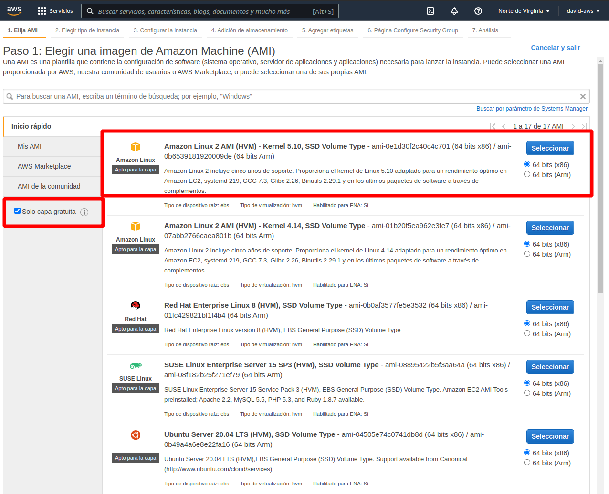

5. una vez escogido el ssoo (en nuestro caso una VM de amazon, que es un linux con algunos programas preinstalados como python, postgres, ruby,...) debemos escoger un hardware para esta máquina  
   
    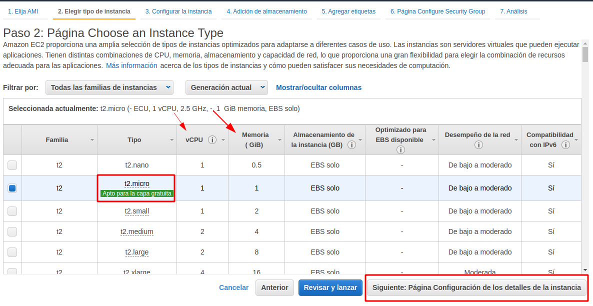

6. seguimos viendo sus características y pasamos a la sección de detalles de la instancia (aquí no tocamos nada)
 
    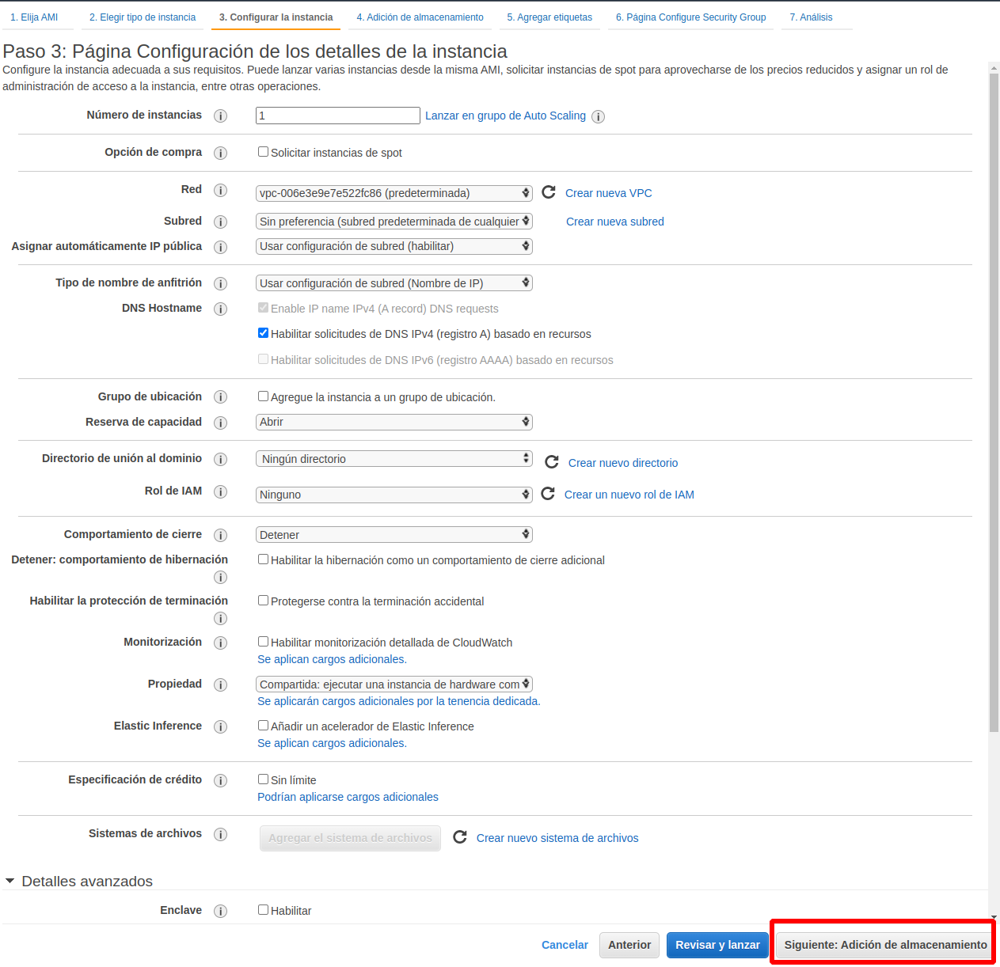

7. Opciones de apmacenamiento (8GB es la oferta gratuita)
 
    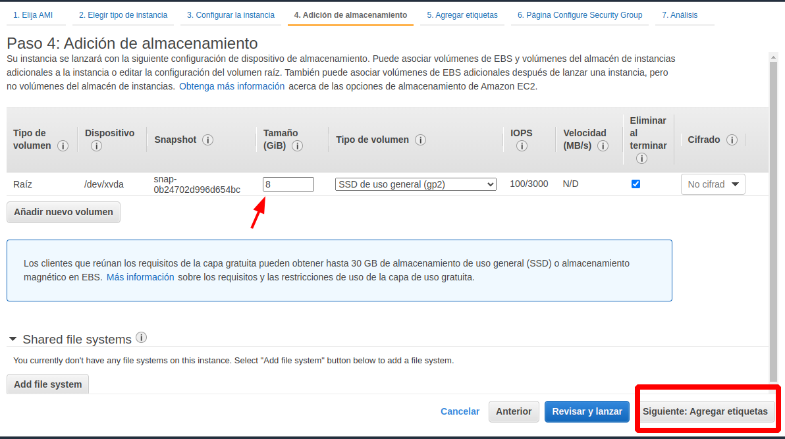

8. Definimos un tag para referirnos a nuestra instancia 
 
    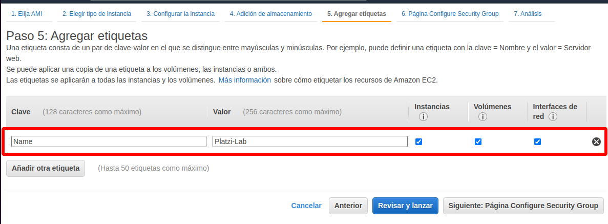

9. Configuramos el grupo de seguridad, es cómo controlamos el acceso a nuestra máquina (VM)
    Para ello configuraremos un única via de acceso q será mediante secure shell - ssh
 
    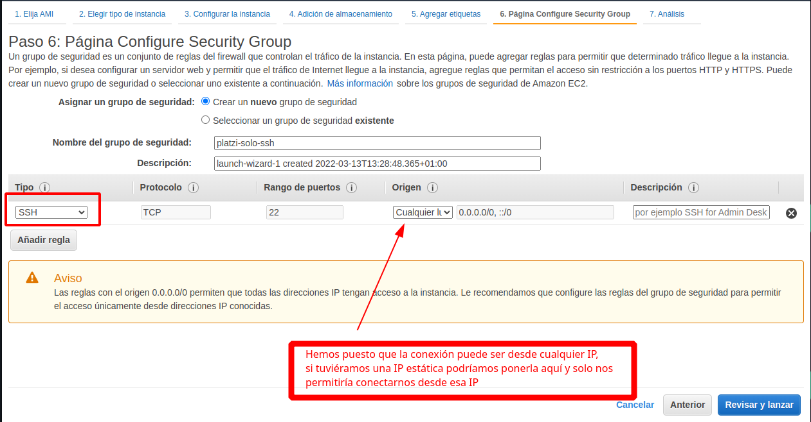

10. La última pestaña es de resumen y le damos a `launch`
 
    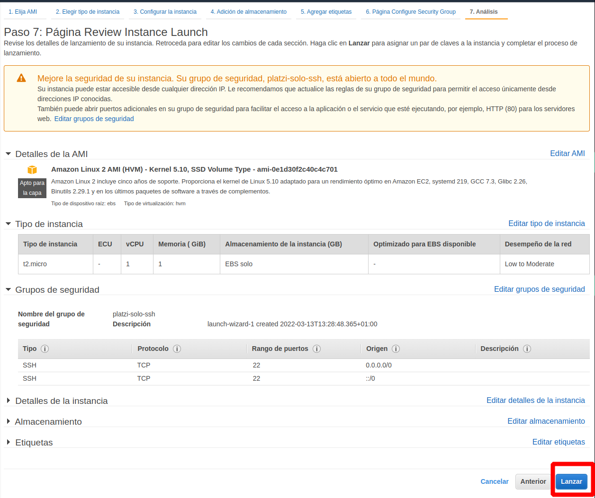

11. encuanto le damos a lanzar nos pedirá con que par llave-valor de ssh queremos conectarnos, como no tenemos ninguna hay q crearla 
 
    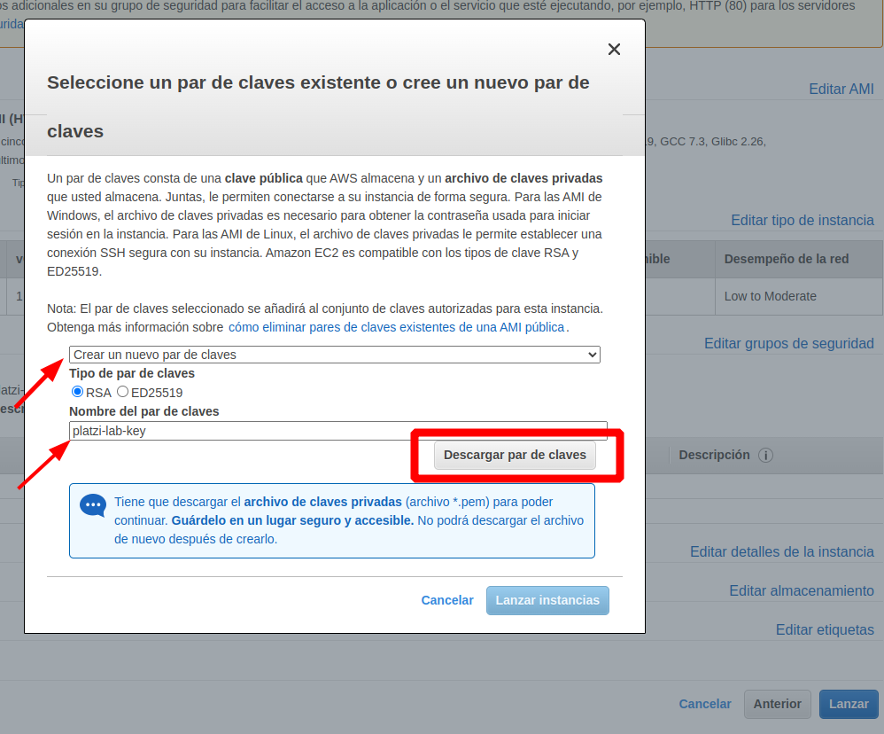

    1. Esto nos bajará una llave para conectarnos nos AWS (archivo .pem)

12. Y le damos a lanzar instancia 
 
    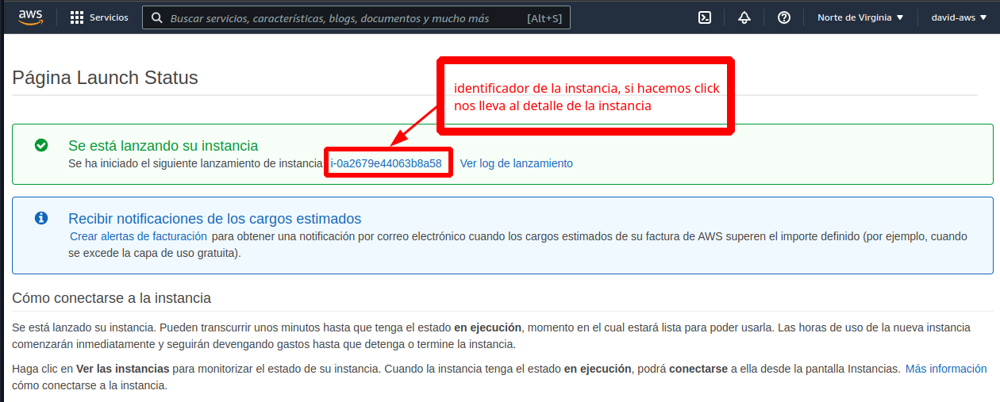

13. Esto nos llevará a nuestra instancia de EC2
 
    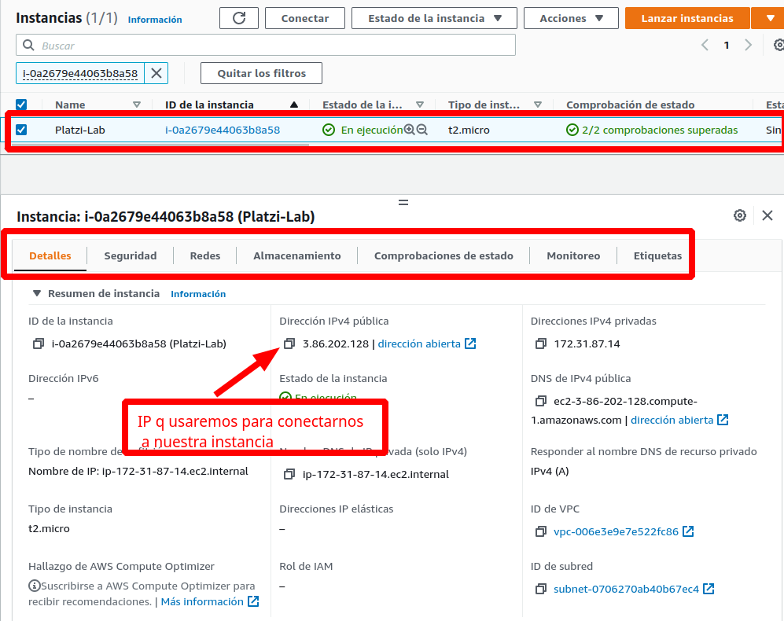


## Conexión a nuestra instancia de EC2 

Para conectarnos nos dirigimos dnd tenemos la ssh-key y abrimos consola:

1. como nos conectamos a una instancia de una VM de amazon el user es `ec2-user` y añadimos la IP pública de la instancia 

```
ssh -i platzi-lab-key.pem ec2-user@3.86.202.128
```

Esto hecho así nos arrojará un error 

```
david@david-main ~/Descargas ❯ ssh -i platzi-lab-key.pem ec2-user@3.86.202.128

The authenticity of host '3.86.202.128 (3.86.202.128)' can't be established.
ECDSA key fingerprint is SHA256:vPSU0WxtfwUzNm8SLcrvVVIqvba+JneJwio4WaqufII.
Are you sure you want to continue connecting (yes/no/[fingerprint])? y
Please type 'yes', 'no' or the fingerprint: yes
Warning: Permanently added '3.86.202.128' (ECDSA) to the list of known hosts.
@@@@@@@@@@@@@@@@@@@@@@@@@@@@@@@@@@@@@@@@@@@@@@@@@@@@@@@@@@@
@         WARNING: UNPROTECTED PRIVATE KEY FILE!          @
@@@@@@@@@@@@@@@@@@@@@@@@@@@@@@@@@@@@@@@@@@@@@@@@@@@@@@@@@@@
Permissions 0664 for 'platzi-lab-key.pem' are too open.
It is required that your private key files are NOT accessible by others.
This private key will be ignored.
Load key "platzi-lab-key.pem": bad permissions
ec2-user@3.86.202.128: Permission denied (publickey,gssapi-keyex,gssapi-with-mic).

```

esto es xq el archivo de la ssh-key (.pem) debe tener unos permisos concretos. 

   1. Primero la movemos a directorio ssh 
       ```
        david@david-main ~/Descargas ❯ mv platzi-lab-key.pem ~/.ssh 
       ```
   2. le damos los permisos necesarios 
      ```
        david@david-main ~/.ssh ❯ chmod 400 platzi-lab-key.pem
      ``` 
   3. nos conectamos
      ```
        david@david-main ~/.ssh ❯ ssh -i platzi-lab-key.pem ec2-user@3.86.202.128

       __|  __|_  )
       _|  (     /   Amazon Linux 2 AMI
      ___|\___|___|

        https://aws.amazon.com/amazon-linux-2/
        No packages needed for security; 5 packages available
        Run "sudo yum update" to apply all updates.
        [ec2-user@ip-172-31-87-14 ~]$
      ```

Dependiendo del tipo de instancia la conexión es con un user diferente :

* Amazon Linux 2 o Amazon Linux AMI => usuario es ec2-user.

* CentOS AMI => centos.

* Debian AMI => admin.

* Fedora AMI => ec2-user o fedora.

* RHEL AMI => ec2-user or root.

* SUSE AMI => ec2-user or root.

* Ubuntu AMI => ubuntu.

## Subir nuestro proyecto a EC2 

1. instalr git en la instancia 

```
sudo yum install git 
```
2. clonamos el repo del proyecto.
   
   1. 
   Desde q github realiza conexiones ssh necesitamos crear una llave ssh en cada maquina q usamos para poder añadirla a nuestra cuenta de github y poder usar github desde esa máquina. Así que antes de poder clonar debemos:
    1. crear usuario git (todo en la VM de EC2)
    ```
     git config --global user.name 'tu nombre'
     git config --global user.email tu_email@gmail.com

    ```
    1. Crear una llave ssh para el usuario de github 
    ```
    ssh-keygen -t rsa -b 4096 -C "tu_email@gmail.com"
    ```
    1. una vez tienes generada la llave la copiamos en el perfil de github 
    ```
    cat ~/.ssh/id_rsa.pub
    ssh-rsa XXXXX
    ```
    1. comprobamos q ssh está activo en la máquina 
    ```
    [ec2-user@ip-172-31-87-14 .ssh]$ eval $(ssh-agent -s)
    Agent pid 3296
    ```
    1. añadimos la nueva ssh-key 
    ```
    [ec2-user@ip-172-31-87-14 .ssh]$ ssh-add ~/.ssh/id_rsa
    ```
    1. listo ya podemos usar github desde la temrinal

3. Instalación  de dependencias del proyecto 
   1. pip3 install flask 
   2. 